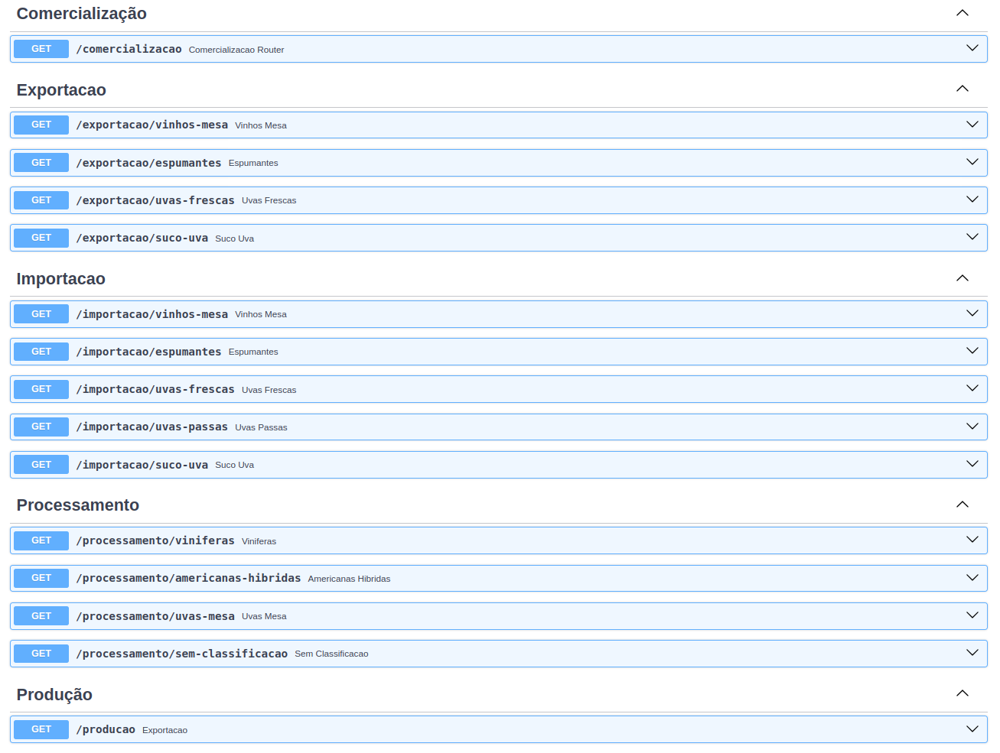
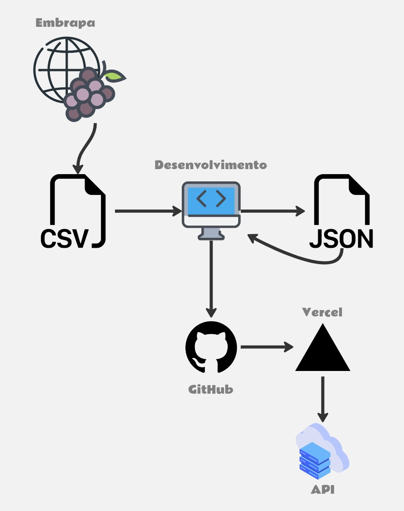

# 🍇 API - Vitivinicultura 🍇

Este é um projeto e um Tech Challenge do curso de especialização em
Machine Learning Engineering da **FIAP**, referente à fase 1.

## 📝 Objetivos
- [x] Criar uma Rest API em Python que faça a consulta no site da Embrapa. 
- [x] Documentar a API.
- [ ] Implementar um método de autenticação (recomendável).
- [x] Criar um plano para fazer o deploy da API. 
- [x] Fazer um MVP realizando o deploy com um [link compartilhável](https://api-vitivinicultura.vercel.app/) e um repositório no GitHub. 

## ⚙️ Instalação e Configuração
Para executar o projeto localmente, siga os passos:

1. Clone o repositório.
2. Na pasta raiz do projeto, instale as bibliotecas:
```
pip install -r requirements.txt
```
3. Execute o projeto:
```
uvicorn main:app
```

## 📜 Documentação
Confira a documentação da API
[clicando aqui](https://api-vitivinicultura.vercel.app/docs).


## 📡 Plano de Deploy
Atualmente a API já está hospedada. O plano
utilizado para o deploy foi o seguinte:



🔗 O link base da API é: https://api-vitivinicultura.vercel.app/

*Confira a documentação para consultar as rotas.*